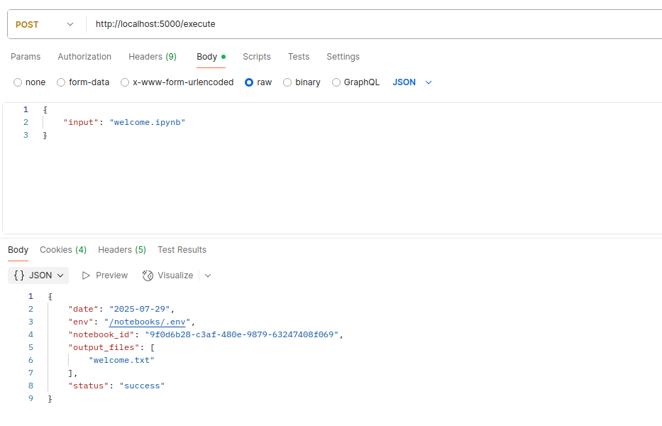
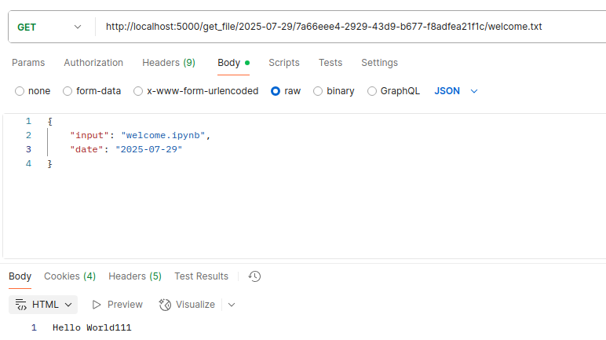

# Описание

Утилита для выполнения `jupyter` тетрадок через HTTP-запросы

## Сборка

`docker build -t akrasnov87/papermill-runner:1.0.0 .`

## Использование
`docker run -p 5000:5000 -v ./notebooks:/notebooks --name etl akrasnov87/papermill-runner:1.0.0`

### Выполнение (execute)

<pre>
POST /execute

{
    "input": [имя файла тетрадки с расширением],
    "date": [дата выполнения, можно не указывать, тогда будет текущая],
    "env": [путь к файлу с глобальными переменными, можно не передавать],
    "notebook_id": [идентификатор, можно не передавать],
    "output": [выходной каталог, можно не указывать]
}
</pre>

Response:
<pre>
{
    "date": "2025-07-29",
    "env": "/notebooks/.env",
    "notebook_id": "7a66eee4-2929-43d9-b677-f8adfea21f1c",
    "output_files": [
        "welcome.txt"
    ],
    "status": "success"
}
</pre>

* date: date - дата выполнения
* env: str - имя файла, который использовался для получения глобальных переменных
* notebook_id: str - идентификатор
* output_files: str[] -  выходные результаты
* status: str - статус выполнения

### Получение результата

`GET /get_file/[дата выполнения]/[идентификатор]/[имя выходного файла]`

